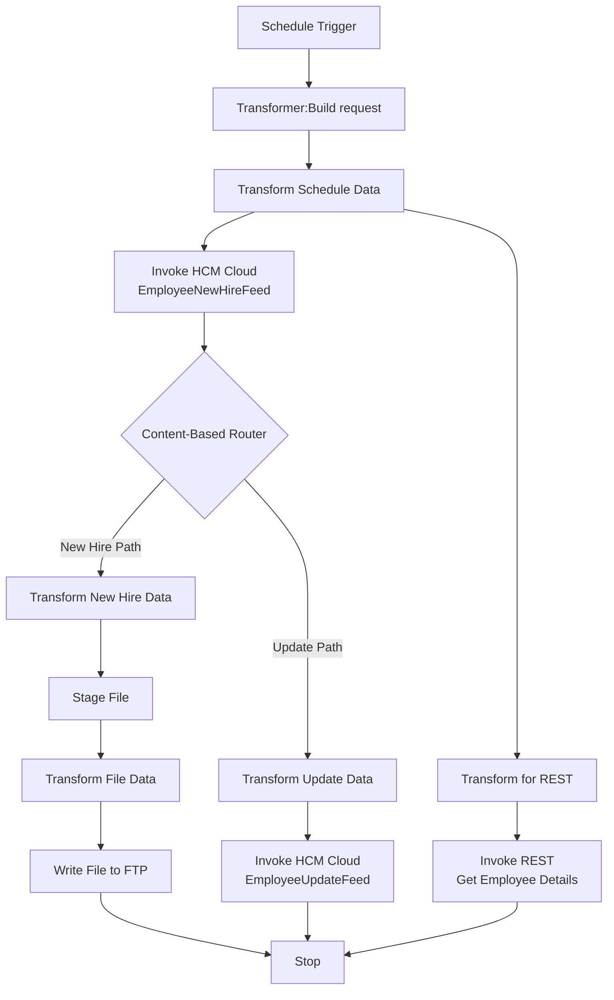
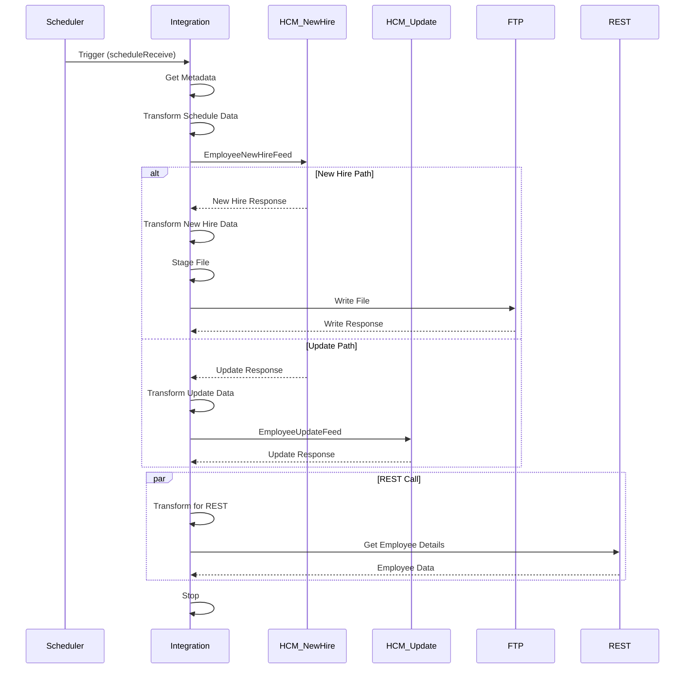

# IMOHCM27_HELM_HCM_EMPLOYEE_MASTER_OUTMAST_OUT_HCMEXTRACT
## Overview
This OIC integration is **scheduled** and uses the **HCM Extract Atom Feed** approach to retrieve new hire data and write it to an SFTP location.

## Integration Flow
| Step  | Description                                                                                                                                        |
| ----- | -------------------------------------------------------------------------------------------------------------------------------------------------- |
| 1 | **Schedule Trigger**: Initiated based on a schedule, captures `atomFeedLastRunDateTime` using a tracking variable.       |
| 2 | **rarmed Request**: the HCM Atom Feed request using the last run date time.                       |
| 3 | **e HCM Atom Feed**: Calls the `EmployeeNewHireFeed` operation via                     |
| 4 | **Content-based router**: checks whether the response contains new hire data. (EmployeeNewHireFeed_Update > 0)                        |
| 5 | **Transform Data to File Format**: Transformer maps Atom Feed response into a structured file format.                     |
| 6 | **Stage File Write**: Writes transformed data to a temporary file using Stage File adapter.                               |
| 7 | **Transform for FTP Output**: Another transformer formats the staged file content for FTP upload.                         |
| 8 | **Write to SFTP**: File is uploaded to the /HELM/outbound/EmpMaster/ using FTP Adapter.                                  |
| 9 | **Invoke REST API (Optional)**: Optionally calls a REST API (`getEmpDetalisRest`) using Rest Invoke /hcmRestApi/resources/11.13.18.05/workers/.  Review Needed!
| 10   | **Assign**: atomFeedLastRunDateTime = startTime
|    | **End**:                                                                         

## Additional Notes

- **`atomFeedLastRunDateTime`**:A schedule parameter used to track the last successful feed poll. Ensures only delta/new records are fetched.
- **Adapters Used**:

  - **HCM Adapter** (`getNewHireFeed`) for Atom Feed extraction
  - **Stage File Adapter** for temporary file creation
  - **FTP Adapter** for final file delivery
  - **REST Adapter** (`getEmpDetalisRest`) for optional data enrichment
- **Transformers**:
  - Three transformers are used for:
    - Preparing AtomFeed request
    - Converting AtomFeed response to file format
    - Reformatting file content before FTP upload
- **Message Tracking**:A global `messageTracker` captures  `startTime`.
- **Error Handling**:  NoReview Needed!</  Defif fault handler to capture `APIInvocationError` for both HCM Adapter and Rest Adppater ations. 

# IMOHCM27_HELM_HCM_EMPLOYEE_MASTER_OUT
## Overview
This OIC integration is designed to extract employee data (both new hires and updates) from Oracle HCM Cloud using Atom Feeds and deliver it to an SFTP location. The integration follows a scheduled approach with delta tracking capabilities. This integration seems a replicated to the previous integrtion 

##  Integration Flow

## 🧭 Integration Steps

| Step  | Flow Description                              |
| ----- | -------------------------------------------------------------------------------------------------- |
| 1 | **Schedule Trigger** — Triggered on a schedule. Captures `atomFeedLastRunDateTime` using message tracking.  |
| 2 | **Transformer: Build Request** — Constructs the Atom Feed request using the last run datetime.           |
|  | **HCM Adapter: Get Atom Feed** — Invokes `EmployeeNewHireFeed` to fetch new hires from Oracle HCM.      |
| 4 | **Content-Based Router** — Evaluates whether response contains new data and routes accordingly:                                       |
|       |  •**New HireData Exists**:  (EmployeeNewHireFeed_Update > 0)                                                                                 |
|       | &nbsp;&nbsp;&nbsp;&nbsp;– **Transformer:** Maps Atom Feed response to flat file format.         |
|       | &nbsp;&nbsp;&nbsp;&nbsp;– **Stage File** Writes transformed data to a temp file using Stage File Adapter.  |
|       | &nbsp;&nbsp;&nbsp;&nbsp;– **Transformer:** Formats the staged content for FTP upload.           |
|       | &nbsp;&nbsp;&nbsp;&nbsp;– **FTP Adapter:** Uploads the file to SFTP at `/HELM/outbound/EmpMaster/`.                  |
|       | •**Otherwise**:                 
|
|       | &nbsp;&nbsp;&nbsp;&nbsp;– **Transformer: Prepare Request** — Constructs request to `getUpdateWorker` endpoint. |
|       | &nbsp;&nbsp;&nbsp;&nbsp;– **HCM Adapter: getUpdateWorker** — Sends request to update worker metadata.                  |  **REST Adapter (Optional)** — Optionally calls REST API `getEmpDetalisRest` to fetch more worker info. (**Review if needed**) |
| 🔚    |  **Stop** — Ends the integration.                                                            |

<!--stackedit_data:
eyJoaXN0b3J5IjpbLTgzMjY0NzQ1NSwyNzg4NDE5OTgsLTI0ND
g2MjQ2NCwyMTEzNTE5NzEsLTIyMTYyNDQ0OSwxODMwNDE1NzA5
LC0yMTMyNTAzNjY5LDM0NDA3NTE2OSwtMjA0OTY5Mjg0OSwxMj
YxMDUwMTA0LDEzMjU0Nzk5MCwtMTA4OTY0NTU4MywxMjU1MDY0
MTI0LC0xMTYzMDE3MTM3LDM2MDA4MzQ0MiwtMTA3ODI2MDcwNS
wtMTExNDg3NjY1MSwtNjIyMTQ0NzExXX0=
-->